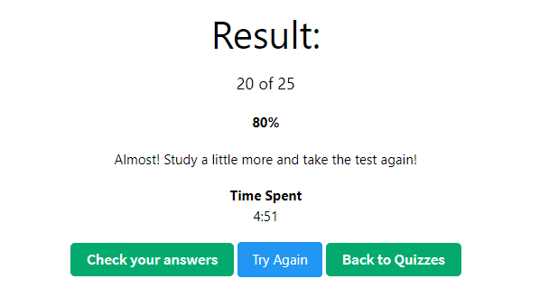

# 100 Days Of Code - Log

### Day 1: March 1st 2023

Basing my journey on Freecodecamp and specifically the new Responsive web design as it is first on the list. https://www.freecodecamp.org/learn/2022/responsive-web-design 

**Today's Progress**: 
Tasks 1 - 14

I refreshed my knowledge on the following HTML basics:
Tags,elements, nested elements, images as SRC's, anchors and targets.

**Thoughts:** 

All of this was a refresh of elements covered in the SoC stage 2 tasks - I was surprised at how much I had forgotten.
This really brought it home to me that practice is so important and will hopefully make me perfect!

I really struggled with step 14 but I managed to figure it out and I guess I am going to feel like this a lot!

### Day 2: March 2nd 2023

**Today's Progress**: 
Tasks 15 - 34

Carried out Freecodecamp ‘Responsive Web Design’ Tasks 15 - 34. Learnt about inserting links to a photo and how to improve accessibility of the image added with an alt attribute. Also tackled inserting sections, ordered and unordered lists, figure elements, figure captions and how to emphasize words with a strong element.

**Thoughts:** 

I was very 'cold' at the start and took a while to warm up and recall from task 14, how to insert image links. Practice, practice, practice!

### Day 3: March 3rd 2023

**Today's Progress**: 
Tasks 35 - 46

Today I added a web form to collect information, actions, input elements, type and action attributes, radio buttons and id attributes.

**Thoughts:** 

Will this all stick??!!
Got tied up in knots over capitals and spaces!

### Day 4: March 4th 2023

**Today's Progress**: 
Tasks 47 - 69 

It's Saturday so I decided to do two hours and complete the final steps of the "Learn HTML by Building a Cat Photo App". 
Hey - I am an expert!!!!!!!
No, no not at all. After focusing on forms for a few sessions, they threw in a request for an anchor element with a link and I thought...yes I know this but how do I construct that again? Yep it had slipped out of the backdoor of my brain. Got there in the end. Then they finished it off with some simple footers and essential title, doctype and meta elements.

**Thoughts:** 

I'm struck by how anxious I feel when asked to recall something I know I have done but have forgotten the precise structure of. So, thoughts like - where do I put that in the syntax. How much of this is memory and how much is it logic and where to look regarding having done something before.

### Day 5: March 5th 2023

**Today's Progress**: 
Learn basic CSS by building a cafe menu
Tasks 1 - 20 

Today I covered inline styling, stylesheets and linking a stylesheet and experimented with alignment and background colours (I mean colors!)

**Thoughts:** 

It's Sunday funday! Finally moving on to coffee from cats and designing a coffee menu. Started off easy and then stumped by a couple of recap ideas from HTML stage.

Still making mistakes by using English spelling rather than american.
I LOVE the intro to CSS and find the commands a bit easier than HTML at this early stage of learning.

### Day 6: March 6th 2023

**Today's Progress**: 
Learn basic CSS by building a cafe menu
Tasks 21 - 40 

Today I covered the CSS width (pixels and %'s) property, comments in CSS, class selectors, class attributes, background images, article elements, alignment, 

**Thoughts:** 

Still finding the intro to CSS commands a bit easier than HTML at this early stage of learning.

### Day 7: March 7th 2023

**Today's Progress**: 
Continued with: Learn basic CSS by building a cafe menu
Tasks 41 - 60 

Today started by recapping text widths, then moved on to adding multiple class selectors, the padding properly, max-width property, font-family, fallback values for fonts and font styles

**Thoughts:** 

Still finding the intro to CSS commands a bit easier than HTML at this early stage of learning.

### Day 8: March 8th 2023

**Today's Progress**: 
Continued with: Learn basic CSS by building a cafe menu
Tasks 61 - 82 

Introduced to 
 and changed line widths. Also beginning to understand when to use a "." (dot) and when not to use a "." when selecting elements / classes to style. Then covered the rainbow of colors for styling <a> link properties (visited, hover, active).

**Thoughts:** 

Found today the easiest day so far!
  
### Day 9: March 9th 2023

**Today's Progress**: 
Finished Learn basic CSS by building a cafe menu
Tasks 83 - 91. This covered margin spaces, refresh of image links, spacing around images and negative margins.

Decided to spend an hour reviewing github basics and a further hour on basic command prompts.

**Thoughts:** 

I found it easier to learn when following freecodecamp lessons than 'just reading'.
  
### Day 10: March 10th 2023

**Today's Progress**: 

Dived into the School of Code Stage 2 additional reading and in particular read https://bit.ly/2yoR5T8 This is part 1 of Understanding Git. 
A really helpful explanation.

Today I met up with fellow South Coast bootcampers and all were discussing JavaScript - of which I know nothing!
So I spent the second part of my session doing steps 1-10 (9%) of Basic Javascript. Covered comments, data types, variables, Storing Values with the Assignment Operator, Assigning the Value of One Variable to Another, Initializing Variables with the Assignment Operator, Declaring String Variables, Uninitialized Variables, Understanding Case Sensitivity in Variables, var and let differences and finally Declaring a Read-Only Variable with the const Keyword.

**Thoughts:** 

Cannot wait to do 8 hours or so a day of this!
I loved the intro to JavaScript!
  

### Day 11: March 11th 2023

**Today's Progress**: 

Continued with Basic JavaScript, provided by FreeCodeCamp.
Covered:

Declare a Read-Only Variable with the const Keyword
Subtract One Number from Another
Multiply Two Numbers
Divide One Number by Another
Increment a Number
Decrement a Number
Create Decimal Numbers
Multiply Two Decimals
Divide one Decimal by Another
Finding a Remainder
Compound Assignment With Augmented Addition, Subtraction, Multiplication, Division, 
Escaping Literal Quotes in Strings 
Quoting Strings with Single Quotes 
Escape Sequences in Strings
  
**Thoughts:** 

Wow! All so easy until "Assign the following three lines of text into the single variable myStr using escape sequences"

FirstLine
\SecondLine
ThirdLine

Struggled to get to this:
const myStr = "FirstLine\n\t\\SecondLine\n\ThirdLine"; 

### Day 12: March 12th 2023

**Today's Progress**: 

Continued with Basic JavaScript, provided by FreeCodeCamp.
Covered:

Concatenating Strings with Plus Operator
Concatenating Strings with the Plus Equals Operator
Constructing Strings with Variables
Appending Variables to Strings
Find the Length of a String

**Thoughts:** 

Shorter session today as I wanted to check that I have everything set up for fist day of School of Code tomorrow, in terms of running latest apps etc 

Day 13: March 13th 2023
Today's Progress:

Long day today - I'm sure I'll get used to this. First day of SoC. Great intro - motivating and excellent introduction.
Wrote up my notes and decided to use my Hour of Code to finish the CSS Diner challenges at https://flukeout.github.io/
In the session today I progressed to level 15 in my pair programming session, so this evening I finished the remaining levels to 32.
I got the hang of it and really enjoyed it - great way to learn.
  
First Child Pseudo-selector
Only Child Pseudo-selector
Last Child Pseudo-selector
Nth Child Pseudo-selector
Nth Last Child Selector
First of Type Selector
Nth of Type Selector
Nth-of-type Selector with Formula
Only of Type Selector
Last of Type Selector
Empty Selector
Negation Pseudo-class
Attribute Selector
Attribute Value Selector
Attribute Starts With Selector
Attribute Ends With Selector
Attribute Wildcard Selector

Thoughts:

Seems that some of the descriptions above are more complicated than the actual commands.
One day at a time and take on board all the good advice given today about the method of learning and the truth about being well outside of my comfort zone!

### Day 14: March 14th 2023
**Today's Progress:**

This felt like another long day today. Second day of SoC. 
We covered more computational thinking, reflective learning, and self-management. All okay I thought and then we tried to solve a scratch challenge.
It was difficult to remember how to solve a simple game based on a user guessing if the next number generated will be more or less than the previous number. There were to be 5 rounds, and the users score would increase or decrease based on whether they guessed correctly or not. My coding team (Lawrence and Lucy) had a good stab but we couldn't quite get there with the loop.

Then this was followed by revisiting Git! If you are reading this then I managed to clone my repository, make changes, and push them back up, rather than simply editing the readme file online!!!!! :grin:

With Git, we looked at the rhythm of changes from starting a new project, making changes (as a team) and pushing / pulling them back down.
I do need much more practice as I am unsure of how branches work and lots of other things. In fact, at this stage I do not even know what I do not know.
I'm pleased if this appears online though :blush:

Tom Burns stayed online after class finished and pointed me in the direction of helpful resources - star! :star2:

Other resources and tools which were new to me today are:
Google Jamboard and Diagrams.net

For the remaining 30 mins of my time, I recapped basic JavaScript functions to help me first thing tomorrow as I believe that is how the day starts - after the squats! :smiley:

**Thoughts:**

Still taking this one day at a time. Hardest thing right now is to not feel overwhelmed and just keep practicing.
Read this online and found mistakes - so had to prove to myself I could amend and upload again - If I can see this line, I did it! :two_hearts:

### Day 15: March 14th 2023
**Today's Progress:**

It was explained to us why we will be focusing on Javascript (as opposed to other possible languages) - whilst it was written in 10 days, it is the current leading language for Web.

Today we covered:
The 5 pillars of learning good JS and how to learn by REPL.

Our main task was to use our newfound JavaScript knowledge to make a secret only available to people who knew the correct password.

We used:

variables, if statements, loops, functions

Then, we declared a function that prompts the user for input - a password. 
We stored that password in a variable within the function
Checked whether the password matched the correct password 
If it did, returned a true from the function.
If it didn't, let them try again.
If they failed three times in a row, it returned a false from the function.

Then:

👉 We Refactored the code into a function called an authenticateUser. This returned a true if the user logged in successfully with the correct password and false if they got the password wrong more than three times. 

I got there in the end (Google was my friend) and I don't know if i could do it again without practising many many times.

I tried to push all my changes to Git Hub - I couldn't see that this worked, but my Visual Code said it worked and my code buddy said he could see the changes. At the moment I am like a rabbit in the headlights with Git.

Other resources and tools which were new to me today are:
https://30secondsofknowledge.com/ - wow - what a cool tool! I've installed this and set it to JS.

**Thoughts:**

HELP!

At the risk of repeating myself. This felt like another (very) long day. Third day of SoC. 

I seem to have moments of eureka, followed by despair.

I've worked out how to add a spell checker extension here, added it and (hopefully) removed my mistakes!
Will I be able to push these changes to GitHub? Let's find out! :grin: AGAIN!

### Day 16: March 16th 2023
**Today's Progress:**

We were introduced to objects and arrays. We then had an excellent presentation by Joseph Trodden where we focused on the purpose of feedback how to give and receive good feedback and this was very engaging along the emphasis once again that working in teams is critical for success in the workplace.

We covered casing, Let, Const and Var.

We set files up (HTML and JS) and linked them in VSC.

We looked at how to create arrays, select from an array, ask the console about the length of an array, remove the last element.

👉 Other resources and tools which were new to me today are:

My programming teammate introduced me to more keyboard shortcuts and how to edit multiple lines in VSC. 

I had my first session with my mentor. I have never had a mentor before. It was brilliant – I really appreciated being able to ask stupid questions!

**Thoughts:**

We started with a quiz!!!! I was not expecting that and managed 5/8. 
More revision / practice needed, but I knew that yesterday was a confusing day for me. 
They really meant it when they said thrive outside of your comfort zone! 
I really need to accelerate the feeling of being comfortable with not knowing everything. 
It also feels incredibly strange to be permitted to Google the answer.

### Day 17: March 17th 2023
**Today's Progress:**

It started with a :kiss: I mean quiz, to check learning so far - I definitely have some knowledge gaps. After a re-cap of topics covered this week we dived into my first hackathon. This week, we had to use JavaScript to create a Rock, Paper, Scissors game.

We mastered git (only kidding). We progressed our understanding of Git and managed to send commits up and down and we also managed a fair number of the required tasks. I have weekend homework and I'm looking forward to cementing some concepts over the weekend.

👉 Other resources and tools which were new to me today are: 

My coding partner showed me how to preview this log before pushing changes and noticing errors after the event. 

**Thoughts:**

Today I discovered that sometimes Chat GPT can mess up and send you answers to a question you did not ask. I'd like to say we are only human but ....

### Day 18: March 18th 2023
**Today's Progress:**

Today I spent the day reviewing the entire weeks teachings from School of Code and testing myself at the console.

I re-capped the following: 

Computational thinking
Declaring and assigning variables
Using variables
Types
Primitive types (strings, numbers, booleans)
Arrays and objects
Functions
How to declare a function (with parameters)
How to call a function (with arguments)
How to use a function’s return value (if there is one)
Loops
While
For
If statements
Operators (+, -, *, /, =, %, etc.)

I then tested myself by continuing with freeCodeCamp's Basic Javascript course. 

👉 I found and like the format of https://htmlcheatsheet.com/js/ 

**Thoughts:**

I still need need to practice writing javascript. Practice definitely moves me further towards being better!

### Day 19: March 19th 2023
**Today's Progress:**

This am, I met up with 5 fellow School of Code students (Michael, Tom, Ahia, Vicky and Christian), for a couple of hours to recap on some fundamentals (JS arrays, Functions and Loops).

I then progressed through 30 or so further freeBootCamp JS questions (until I reached an area not yet covered by SoC, "Selecting from many options with Switch Statements"). 
Finally, I completed the W3Schools JS Quiz Test for a change. I scored 80% which is much better that the tests with SoC this week and considering I haven't covered some of the areas yet I was pleased with this progress.

 and then revisited the code written for the hackathon to solve the Rock, Paper, Scissors challenge.

**Thoughts:**

I feel like I can read and understand certain lines of code, but when it comes to writing it, I often confuse syntax - particularly with regards to the choice of bracket types. 

I hope that week 2 of SoC cements some of these concepts. :sweat_smile:

### Day 20: March 20th 2023
**Today's Progress:**

Today, the SoC introduced us to the DOM!
I never appreciated that when a web page is loaded, the browser creates a Document Object Model of the page!

This is totally new - I thought that the JS simply worked alongside the HTML and CSS pages and the DOM, with JS gets all the power it needs to create dynamic HTML.

We worked in a team of 3 (with Hani and James) and practiced:

How to change the content of HTML elements
How to change the style (CSS) of HTML elements
How to react to HTML DOM events
How to add and delete HTML elements

I also (finally) completed a CodeWar challenge - better get cracking with these as there will be a SoC leaderboard soon!

I spent my official #100DaysofCode extra hour:hourglass: testing myself on what I have learned today about DOM and I also completed another CodeWar challenge (just the one!).

**Thoughts:**

It was great to see a page respond to a DOM event! :tada:

However, I was alarmed that I had managed to so easily forget CSS and HTML from a few months ago. Quickly picked it up again though. :high_brightness:

### Day 21: March 21st 2023
**Today's Progress:**

I kicked the day off before class with a couple of CodeWar challenges - I could complete a couple of the easier questions and I'm obviously a keen beaver! I then moved on to a 'Wolf in Sheep's Clothing' with my team and I struggled with this. The highs and lows of this journey! I'm sure I'll get it next time.

We then had a talk from a previous Bootcamper Piper Bates who is now successfully employed as a Software Engineer. She gave us a great insight into her journey and the importance of networking and building a strong network of contacts.

We were then introduced to Event Listeners and we experimented with various events and how to use them to change the DOM.

We were told that this is our plaYground and we can do whatever we want with it. We had fun playing with colours, fonts and sizes.

We then revisited our Rock, Paper, Scissors game and we were encouraged to work with Github CoPilot to help us with our code. I was impressed with the suggestions it made and I'm looking forward to using it more. We were also encouraged to explore Chat GPT and I was impressed with the suggestions it made when it was working, but I think we overloaded it with multiple requests and it stopped working. 

I'm frustrated that I  can't produce every aspect of the game that I want and that i can't make it look pretty although I'm sure that will come with time and practice. 

I hope that I look back at this in a couple of weeks and appreciate how far I have come.

**Thoughts:**

It was great to work with the team today cloning, pushing and pulling our work thrugh Github. I'm looking forward to using this more.

### Day 22: March 22nd 2023
**Today's Progress:**

Today we completed the Myers Briggs Personality Test, I have completed this before. We will be working with this tomorrow in a session on Mindset learning.

We were then introduced to asynchronous JavaScript and the concept of callbacks. This was followed by the concept of promises and the concept of async/await.
We looked at setTimeout and setInterval.

We practiced this by moving the hands on a clock and we also practiced using the console to test our code.

Next - API's and how to interact with other organization's data. We used 'Fetch' to get data from an API that served up interesting facts about cats. 
We met JSON - a data format that is used to store and transport data. It is often used when data is sent from a server to a web page.       
And I was introduced to parsing JSON - converting JSON into a JavaScript object.

**Thoughts:**
Overwhelmed by the amount of information we were given today. I'm looking forward to the next few days to consolidate this learning.
